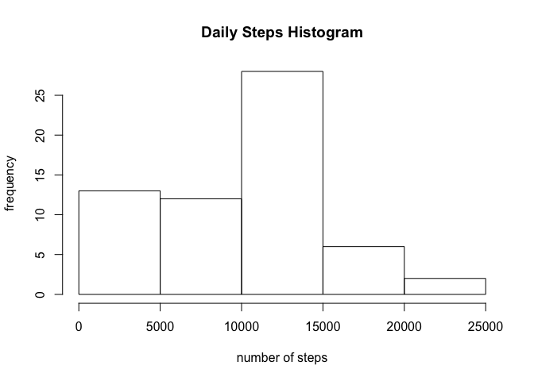
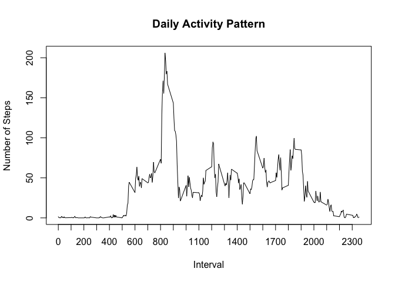
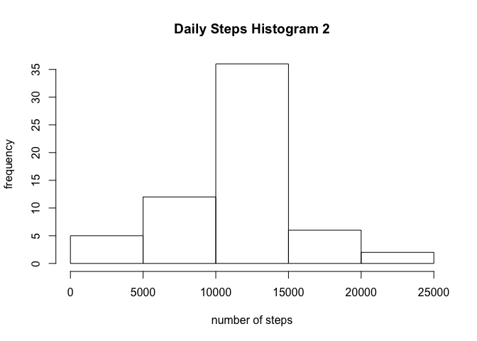
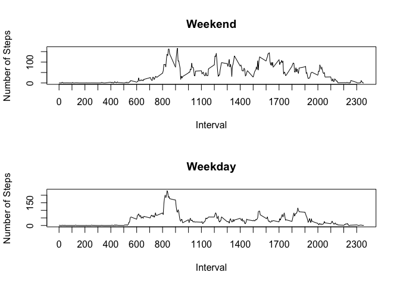

# Reproducible Research: Peer Assessment 1
The data for this analysis was collected over two months by an anonymous individual using a personal activity monitoring device. It includes the number of steps taken in 5 minute intervals each day.    
  
## Loading and preprocessing the data
*Questions 1 and 2*  
The following code chunk loads the data into a data frame table using the dplyr package.  

```r
data <- read.csv("activity.csv")
library(dplyr)
dataset <- tbl_df(data)
```
  
  
## What is mean total number of steps taken per day?
*Question 1*  
First we calculate the total number of steps taken per day.  

```r
dataset <- tbl_df(data)
dataset <- group_by(dataset, date)
dateStepSum <- summarize(dataset, sum(steps, na.rm=TRUE))
dateStepSum_df <- as.data.frame(dateStepSum)
colnames(dateStepSum_df) <- c("Date", "Steps")
print(dateStepSum_df)
```

```
##          Date Steps
## 1  2012-10-01     0
## 2  2012-10-02   126
## 3  2012-10-03 11352
## 4  2012-10-04 12116
## 5  2012-10-05 13294
## 6  2012-10-06 15420
## 7  2012-10-07 11015
## 8  2012-10-08     0
## 9  2012-10-09 12811
## 10 2012-10-10  9900
## 11 2012-10-11 10304
## 12 2012-10-12 17382
## 13 2012-10-13 12426
## 14 2012-10-14 15098
## 15 2012-10-15 10139
## 16 2012-10-16 15084
## 17 2012-10-17 13452
## 18 2012-10-18 10056
## 19 2012-10-19 11829
## 20 2012-10-20 10395
## 21 2012-10-21  8821
## 22 2012-10-22 13460
## 23 2012-10-23  8918
## 24 2012-10-24  8355
## 25 2012-10-25  2492
## 26 2012-10-26  6778
## 27 2012-10-27 10119
## 28 2012-10-28 11458
## 29 2012-10-29  5018
## 30 2012-10-30  9819
## 31 2012-10-31 15414
## 32 2012-11-01     0
## 33 2012-11-02 10600
## 34 2012-11-03 10571
## 35 2012-11-04     0
## 36 2012-11-05 10439
## 37 2012-11-06  8334
## 38 2012-11-07 12883
## 39 2012-11-08  3219
## 40 2012-11-09     0
## 41 2012-11-10     0
## 42 2012-11-11 12608
## 43 2012-11-12 10765
## 44 2012-11-13  7336
## 45 2012-11-14     0
## 46 2012-11-15    41
## 47 2012-11-16  5441
## 48 2012-11-17 14339
## 49 2012-11-18 15110
## 50 2012-11-19  8841
## 51 2012-11-20  4472
## 52 2012-11-21 12787
## 53 2012-11-22 20427
## 54 2012-11-23 21194
## 55 2012-11-24 14478
## 56 2012-11-25 11834
## 57 2012-11-26 11162
## 58 2012-11-27 13646
## 59 2012-11-28 10183
## 60 2012-11-29  7047
## 61 2012-11-30     0
```
*Question 2*  
Next we make a histogram of the total number of steps taken each day.   

```r
hist(dateStepSum_df$Steps,
     main = "Daily Steps Histogram",
     xlab = "number of steps",
     ylab = "frequency")
```

 

*Question 3*  
Then we determine the mean and median of the total number of steps taken per day.  

```r
meanSteps <- round(mean(dateStepSum_df$Steps))
medianSteps <- median(dateStepSum_df$Steps)
```
The mean is 9354 and the median is 10395.

  
## What is the average daily activity pattern?
*Question 1*  
Here we make a time series plot of the 5 minute interval and the average number of steps taken, averaged across all days.  

```r
dataset <- group_by(dataset, interval)  
intervalSteps <- summarize(dataset, mean(steps, na.rm=TRUE))
intervalSteps_df <- as.data.frame(intervalSteps)
colnames(intervalSteps_df) <- c("Interval", "Number of Steps")
plot(intervalSteps_df, type="l", xaxt="n", main="Daily Activity Pattern")
axis(side=1, at=seq(from=0, to=2355, by=100))
```

 

*Question 2*  
Then we determine the interval containing the maximum number of steps.  

```r
maxSteps <- max(intervalSteps_df$Number)
maxInterval <- intervalSteps_df[which(intervalSteps_df$Number==maxSteps),"Interval"]
```
On average, the most steps were taken at interval 835.   
  
  
## Imputing missing values
*Question 1*  
First, calculate the total number of missing values in the dataset.  

```r
numMissing <- sum(is.na(data$steps))
```
There are 2304 missing values.

*Questions 2 and 3*  
Next we create a new dataset with missing values filled in. Here, the average number of steps for that 5-minute interval is used to fill in the values.   

```r
dataNoNA <- data
for(i in 1:nrow(data)){
    if(is.na(data[i,1])){
        int <- data[i,3]
        dataNoNA[i,1] <- intervalSteps_df[which(intervalSteps_df[,1]==int),2]
    }
}
```
*Question 4*  
Then we make a histogram of the total number of steps taken each day.  

```r
dataset2 <- tbl_df(dataNoNA)
dataset2 <- group_by(dataset2, date)
dateStepSum2 <- summarize(dataset2, sum(steps))
dateStepSum2_df <- as.data.frame(dateStepSum2)
colnames(dateStepSum2_df) <-c("date", "total steps")
hist(dateStepSum2_df$total,
     main = "Daily Steps Histogram 2",
     xlab = "number of steps",
     ylab = "frequency")
```

 

Here we calculate the mean and median total number of steps taken per day.  

```r
meanSteps2 <- mean(dateStepSum2_df$total)
medianSteps2 <- median(dateStepSum2_df$total)
```
We can compare these values before and after imputing missing values:

```r
compare <- rbind(c(meanSteps, medianSteps),
                 c(meanSteps2, medianSteps2))
colnames(compare) <- c("mean", "median")
rownames(compare) <- c("before", "after")
compare
```

```
##            mean   median
## before  9354.00 10395.00
## after  10766.19 10766.19
```
Imputing missing values using this method increases both the mean and median of total number of steps taken per day. By comparing the 2 histograms, we can tell that fill in missing values made the distribution more normal.      
    
  

## Are there differences in activity patterns between weekdays and weekends?
*Question 1*  
First we create a new factor variable in the dataset with two levels - "weekday" and "weekend".  

```r
dateCol <- dataNoNA[,2]
dateCol2 <- as.POSIXct(dateCol)
dayOfWeek <- weekdays(dateCol2)
dataNoNA[,4] <- dayOfWeek
for(i in 1:length(dayOfWeek)){
    if(dataNoNA[i,4]=="Saturday" | dataNoNA[i,4]=="Sunday"){
        dataNoNA[i,4] <- "weekend"
    } else {
        dataNoNA[i,4] <- "weekday"
    }
}
colnames(dataNoNA) <- c("steps", "date", "interval", "day")
dataNoNA$day <- as.factor(dataNoNA$day)
```
*Question 2*  
Then we plot the 5-minute interval and average number of steps taken, averaged across all weekdays or across all weekend days.  

```r
# Plot weekend steps
par(mfcol=c(2,1))
splitByDay <- split(dataNoNA, dataNoNA$day)
weekends <- splitByDay$weekend
weekends <- tbl_df(weekends)
weekends <- group_by(weekends, interval)
endStepInt <- summarize(weekends, mean(steps, na.rm=TRUE))
endStepInt_df <- as.data.frame(endStepInt)
colnames(endStepInt_df) <- c("Interval", "Number of Steps")
plot(endStepInt_df, type="l", xaxt="n", main="Weekend")
axis(side=1, at=seq(from=0, to=2355, by=100))

# Plot weekday steps
weekdays <- splitByDay$weekday
weekdays <- tbl_df(weekdays)
weekdays <- group_by(weekdays, interval)
dayStepInt <- summarize(weekdays, mean(steps, na.rm=TRUE))
dayStepInt_df <- as.data.frame(dayStepInt)
colnames(dayStepInt_df) <- c("Interval", "Number of Steps")
plot(dayStepInt_df, type="l", xaxt="n", main="Weekday")
axis(side=1, at=seq(from=0, to=2355, by=100))
```

 
